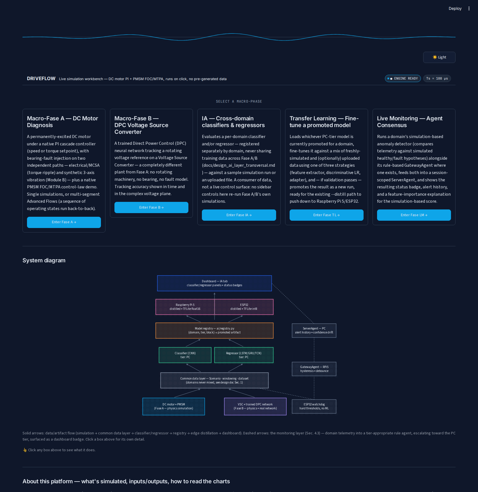

# SPADE

**S**imulation **P**latform for **A**nalysis, **D**iagnosis & **E**lectric drives.

A unified simulation, differentiable predictive control (DPC), and ML fault-diagnosis workbench
for electric drives and power electronics converters, with a live Streamlit dashboard. Nothing on
the dashboard is pre-generated or looked up from a table -- every chart is the direct output of a
real simulation, run fresh each time you click Generate.



## What's inside

Three physically distinct systems, unified under one interface:

| System | Plant | Controller | Fault/robustness angle |
|---|---|---|---|
| **1. DC motor** | Permanently-excited DC motor (same physics/parameters as [gym-electric-motor](https://github.com/upb-lea/gym-electric-motor)) | Native cascaded PI (speed or torque) | Bearing-fault injection on two independent paths: torque ripple (electrical/MCSA) and synthetic 3-axis vibration |
| **2. PMSM FOC/MTPA** | Salient permanent-magnet synchronous motor | Native dq-frame field-oriented current control, MTPA vs. naive policy | Control-law comparison against the analytic MTPA locus and current-limit circle |
| **3. DPC / Voltage Source Converter** | VSC + LCL filter (power electronics, no rotating machinery) | Trained Direct Power Control (DPC) neural network, ported from [DPC4PowerElectronics](https://github.com/aipoweraau/DPC4PowerElectronics) | Off-distribution robustness probes (load resistance, reference magnitude/frequency) + a dataset-upload evaluator for your own data |

System 1 also feeds a fault-injection/diagnosis data-generation pipeline (`src/driveflow/datagen/`)
and the beginnings of an ML diagnosis stack (`src/driveflow/models/`) for training
classifiers/regressors on simulated fault signatures.

**System 2 (PMSM) is not connected to this pipeline at all** -- not even for normal-operation
data. It has no `plant_config_id` and is never dispatched through `Scenario`/`run_scenario`; the
dq-frame FOC/MTPA controller (`control/classical/pmsm_foc.py`) is called directly by the dashboard
for a standalone control-law comparison (MTPA vs. naive policy on short current steps), with no
fault model and no dataset export path. See that module's own docstring for the same statement.

## Quick start

Requires Python 3.11 or 3.12, and [`uv`](https://docs.astral.sh/uv/) (or plain `pip`).

```bash
uv venv --python 3.11 .venv
source .venv/bin/activate
uv pip install -e ".[dev,viz]"
```

Run the dashboard:

```bash
streamlit run src/driveflow/viz/dashboard.py
```

Run the tests:

```bash
pytest
```

The `viz` extra (`streamlit`, `plotly`) is only needed for the dashboard; `dev` (`pytest`) only
for the test suite. Core simulation/control code (`numpy`, `scipy`, `tensorflow`, ...) installs
with the package itself.

## Repository layout

```
src/driveflow/
  sim/            physics: DC/PMSM/induction motor models, VSC plant, bearing-fault injection,
                  synthetic vibration synthesis
  control/
    classical/    PI controller, PMSM FOC/MTPA
    dpc/          DPC network, model-based training loss, receding-horizon controller
  datagen/        Scenario dataclass + runner -- turns a config into a simulated dataset/trace
  models/         ML diagnosis stack: windowing, dataset splits, classifiers, regressors
  viz/            the Streamlit dashboard
experiments/      standalone scripts: train/fine-tune/evaluate the DPC network, generate
                  diagnosis datasets, calibrate the vibration module
tests/            pytest suite
configs/          the 3 shipped DPC checkpoints (see below) + vibration module calibration
```

## The DPC checkpoints

`configs/*.weights.h5` ships 3 small (~21KB) trained checkpoints so the dashboard and
`experiments/evaluate_dpc*.py` work immediately, with no local training run required:

- `dpc_trained.weights.h5` -- base checkpoint, trained on `Data4train.mat`'s open-loop holdout split.
- `dpc_trained_v2_closed_loop.weights.h5` / `dpc_trained_v3_closed_loop.weights.h5` -- successive
  closed-loop fine-tunes (see `experiments/finetune_dpc_closed_loop.py` /
  `continue_finetune_dpc.py`). **v3 is what the live dashboard and `evaluate_dpc_closed_loop.py`
  use by default.**

To retrain from scratch you'll need `Data4train.mat` from the original
[DPC4PowerElectronics](https://github.com/aipoweraau/DPC4PowerElectronics) repository (not
redistributed here) -- see `experiments/train_dpc.py --help` and `DATA.md` for the full dependency
note (also covers the KAt-DataCenter/Paderborn bearing dataset the vibration module depends on).

## Design notes

- One ML framework throughout: Keras/TensorFlow (no PyTorch, no sklearn/XGBoost as a final model).
- Simulation is decoupled from `gymnasium.Env` -- `SCMLSystem` (`sim/scml_system.py`) is driven
  directly, not through the full Gym environment layer.
- DPC is NOT a drop-in alternative to the classical PI controller: it operates on a different
  physical domain entirely (a Voltage Source Converter -- no motor, no mechanical side, no rotor)
  with no state space, plant, or control objective in common with PI/MPC's motor domain. There is
  no "same conditions" under which to compare DPC vs. PI/MPC performance -- see `docs/patch5_alcance_macrofase_B.md`.
- No large datasets are committed to the repository (see `.gitignore`); the dashboard and
  `datagen/` generate everything on demand.

## Credits

This project consolidates and ports code from two MIT-licensed upstream projects:

- **[DPC4PowerElectronics](https://github.com/aipoweraau/DPC4PowerElectronics)** (Copyright (c)
  2024 AI-Power) -- the original MATLAB Direct Predictive Control implementation for a Voltage
  Source Converter. `src/driveflow/control/dpc/` and `src/driveflow/sim/vsc_system.py` are a
  Keras/TensorFlow port: network architecture, the identified discrete-time plant matrices, and
  the training loss were verified line-for-line against this source.
- **[gym-electric-motor](https://github.com/upb-lea/gym-electric-motor)** (Copyright (c) 2019
  Paderborn University -- LEA) -- `src/driveflow/sim/motors/` adapts its motor physics/parameter
  models, decoupled from its `gymnasium.Env` step-callback interface.

## License

MIT -- see [LICENSE](LICENSE).
