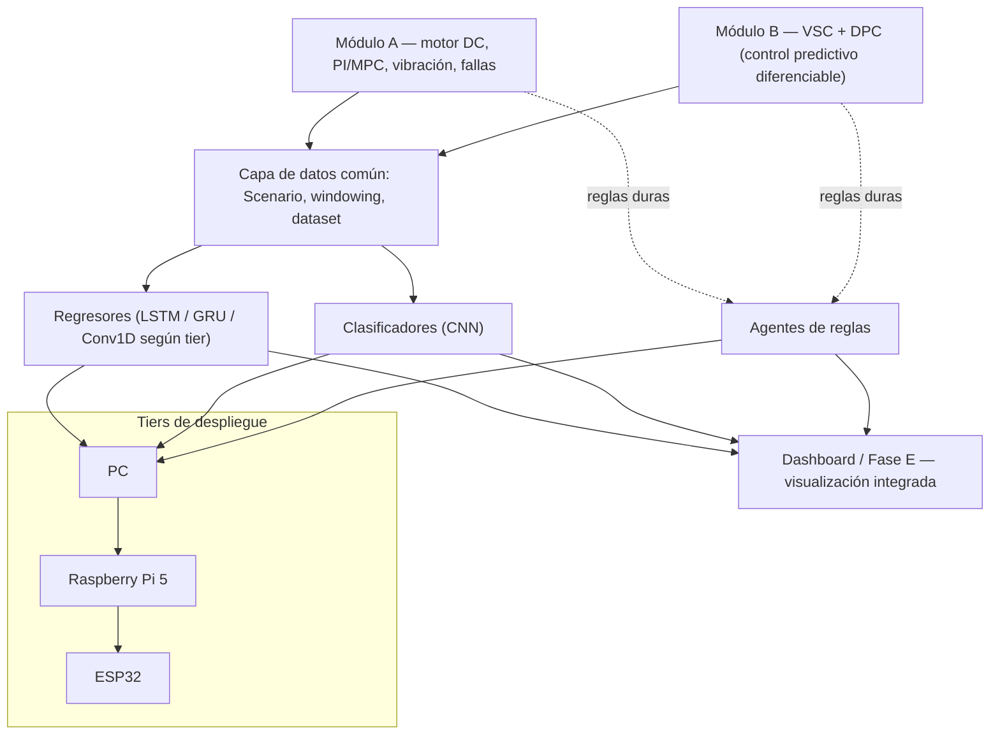

# SPADE / driveflow — Diseño de la capa de IA transversal

**Generado:** 2026-09-01. Complementa a `docs/INSTRUCTIONS.md` y a `SPADE_tareas_correccion.md`
(no versionado en este repo). Este documento es la especificación de una capa nueva, no un
reemplazo del roadmap de fases existente (A/B/C/D/E, ver `INSTRUCTIONS.md` Sección 2) — se apoya
en él y lo extiende.

**Estado de implementación:** ver la nota al final de este documento.

## 1. Principio de diseño

Los módulos A y B son físicamente independientes (Patch 5: DPC y PI/MPC no son comparables bajo
las mismas condiciones). La capa de IA que se describe acá no debe romper ese aislamiento:

- No se entrena un modelo único que mezcle datos de A y B.
- Cada dominio conserva sus propios modelos y checkpoints.
- Lo transversal está en la interfaz común, la infraestructura de orquestación y el mecanismo de
  configuración — no en los pesos entrenados ni en un dataset compartido entre dominios.

En otras palabras: mismo contrato de datos, mismo patrón de código, mismo mecanismo de registro,
configuración y despliegue — pero instancias de modelo separadas por dominio.

## 2. Diagrama de referencia



Notas:

- Mermaid renderiza nativamente en GitHub sin dependencias adicionales — no requiere imagen
  estática.
- Si se prefiere una imagen (para docs generadas con Sphinx/MkDocs sin soporte Mermaid), exportar
  este mismo diagrama a SVG/PNG y versionarlo en `docs/assets/`.
- Mantener el diagrama versionado junto al código: si cambia la arquitectura, este bloque mermaid
  se actualiza en el mismo commit.

## 3. Estructura de directorios propuesta

```
src/driveflow/
  ai/
    registry.py               # mapea (domain, tier) -> ruta al artefacto ganador (pesos+config+métricas)
  models/
    common/                    # YA EXISTE: windowing.py, splits.py, dataset.py, filtro de dominio
    regressors/
      envelope_forecaster.py      # YA EXISTE — revisar si cumple el rol de forecaster o es otra cosa
      builder.py                   # NUEVO — build_forecaster(config) -> keras.Model
      schemas.py                    # NUEVO — esquemas de config por tier (pydantic/dataclasses)
    classifiers/
      sensor.py                   # YA EXISTE — DS-CNN, tier ESP32 (candidato a migrar al builder)
      gateway.py                   # YA EXISTE — ResNet-1D+SE, tier Raspberry Pi 5 (ídem)
      builder.py                    # NUEVO — build_classifier(config) -> keras.Model
      schemas.py                     # NUEVO — esquemas de config por tier
  monitoring/
    agents/
      watchdog_esp32.py           # NUEVO — reglas duras, sin dependencia de modelos ML
      agent_gateway.py              # NUEVO — reglas con estado, tier Raspberry Pi 5
      agent_server.py               # NUEVO — razonamiento contextual amplio, tier PC
    rules/
      schema.py                    # NUEVO — esquema de regla (condición, severidad, acción)
      dc_motor.yaml                  # reglas del dominio A
      vsc_dpc.yaml                    # reglas del dominio B — incluye la regla de R∈[1,3]Ω (ver 6.3)
  viz/
    dashboard.py                 # YA EXISTE — NO agregar widgets de IA acá (ver Sección 5)
    dpc_upload_validation.py      # YA EXISTE — generalizar, ver Sección 5.2
    ai_dashboard.py                # NUEVO — pestaña IA independiente (ver Sección 5)

configs/
  classifiers/
    esp32_dscnn.yaml
    rpi5_resnet1d_se.yaml
    pc_server.yaml
  regressors/
    esp32_tiny.yaml
    rpi5_edge.yaml
    pc_full.yaml

experiments/
  train_model.py                 # NUEVO — script único parametrizado por --config (ver Sección 6)
```

## 4. Detalle por bloque de IA — arquitectura y despliegue por tier

### 4.1 Regresores (proyección de señales)

| Tier | Arquitectura | Formato | Notas |
|---|---|---|---|
| PC | LSTM apilado (2-3 capas) o LSTM+atención, float32 | Keras/TF nativo | Candidato natural para implementar la Fase D.1 ya planificada (regresor de degradación de seguimiento, dominio DPC). Usar el mismo builder para el dominio A si `envelope_forecaster.py` no cubre ya ese rol. |
| Raspberry Pi 5 | GRU compacto (1 capa, pocas unidades) o LSTM podado | TFLite float16/int8 | Distillado del modelo de PC, no entrenado desde cero. |
| ESP32 | Sin LSTM. Conv1D causal dilatada pequeña, o predictor estadístico simple (suavizado exponencial / Kalman escalar) | TFLite Micro int8, o C puro | Decisión de diseño explícita: LSTM tiene estado interno y coste de inferencia no viable en un MCU ESP32. El esquema de config de este tier no debe ni exponer la opción `recurrent_type: lstm` (ver Sección 6.3). |

Tarea concreta de alto valor: usar el forecaster de tier PC del dominio B para intentar anticipar
la divergencia en R∈[1,3]Ω antes de que ocurra (ver `docs/patch9_correccion_divergencia_dpc.md`
y `tests/test_dpc_robustness_grid.py`).

### 4.2 Clasificadores (estados de operación)

| Tier | Arquitectura | Formato | Notas |
|---|---|---|---|
| PC | CNN más profunda o ensamble (ResNet-1D+SE ampliado) | Keras/TF nativo | Modelo maestro — es el que se compara contra `paper_federative` en la Fase C activa. |
| Raspberry Pi 5 | `gateway.py` (ya existe) | TFLite | Confirmar que se entrena por distillation del modelo de PC, no de forma aislada. |
| ESP32 | `sensor.py` (ya existe) | TFLite Micro int8 | Ídem. |

Dominio B: coincide con la Fase D.2 ya planificada, condicionada a un veredicto de separabilidad
pendiente (INSTRUCTIONS.md Sección 6, Paso 0). No construir el clasificador de B hasta resolver
esa condición.

### 4.3 Agentes de reglas (monitoreo) — el único bloque que no se entrena

| Tier | Rol | Naturaleza |
|---|---|---|
| PC / servidor | Razonamiento contextual amplio: correlaciona señales entre A y B, agrega historial, detecta drift de confianza en los clasificadores, puede sugerir reentrenamiento | Motor de reglas con estado rico, sin restricción de recursos |
| Raspberry Pi 5 | Evalúa reglas locales sobre las salidas del modelo de su propio tier: histéresis, debounce, escalado de severidad. Puede operar sin conexión al PC | Motor de reglas stateful acotado, reglas en YAML por dominio |
| ESP32 | Watchdog de seguridad puro: umbrales duros pre-calculados, sin depender de la salida de ningún modelo ML | Determinístico, sin estado complejo, prioriza latencia sobre sofisticación |

Regla concreta a implementar primero, independiente del resto de esta capa: codificar el rango
conocido de divergencia del DPC (R∈[1,3]Ω, ver `tests/test_dpc_robustness_grid.py`) como regla
dura en `monitoring/rules/vsc_dpc.yaml`. No requiere ningún modelo entrenado.

> **Nota de verificación (2026-09-01):** al implementar este paso se confirmó que el rango
> R∈[1,3]Ω ya está mitigado a nivel de dashboard desde Patch 9 (`MIN_STABLE_LOAD_RESISTANCE_OHM`
> como piso del slider + warning en el override "Custom value"). La regla de esta sección no
> cierra una brecha de producción abierta; es el mismo resguardo expresado como dato (no como
> código de UI) para cualquier camino que no pase por el dashboard — un `Scenario` generado por
> script, o un futuro agente de monitoreo observando un rollout en vivo.

## 5. Diseño de frontend

### 5.1 Principio: separar "control en vivo" de "análisis"

No agregar los widgets de regresores/clasificadores dentro de las pestañas de Módulo A y Módulo B.
`dashboard.py` ya es el archivo más grande del repo (1619 líneas) — agregarle más lógica ahí
agrava un problema de mantenibilidad ya identificado.

En su lugar: una pestaña "IA" nueva, independiente, que actúa como consumidor de los datos ya
generados por A y B (vía la capa de datos común, o vía archivo subido por el usuario) — nunca
como un control adicional sobre la simulación en vivo.

Layout de la pestaña IA:

- Selector de dominio (A / B) — mantiene el aislamiento de Patch 5 también en la UI.
- Selector de fuente de datos: "datos de simulación generados" o "subir archivo".
- Panel de resultados del regresor (proyección) y panel de resultados del clasificador (estado
  detectado + confianza).

### 5.2 Generalizar `dpc_upload_validation.py`

Este archivo ya implementa el patrón de "subir archivo → evaluar con un modelo", pero hoy está
atado exclusivamente al dominio B (DPC). Generalizarlo para que sirva a ambos dominios es
probablemente el primer paso concreto de implementación de esta sección, porque:

- Ya está extraído de `dashboard.py` (testeable sin sesión de Streamlit).
- Ya resuelve el problema de validación de datasets subidos por el usuario, que es exactamente lo
  que la pestaña IA necesita para el dominio A también.

### 5.3 El agente de monitoreo es la excepción transversal — pero como indicador, no como panel

El único elemento de esta capa que sí debe ser visible desde cualquier pestaña (Módulo A, Módulo
B, IA) es el estado agregado del agente de monitoreo: un indicador persistente en la barra
superior (ej. dos badges "A: ok" / "B: alerta"), no un panel completo.

Distinción importante a mantener en el diseño:

- El agente que vigila una simulación en vivo de B necesita observar el loop de control mientras
  corre — su lógica vive conceptualmente pegada al Módulo B, no a la pestaña IA.
- El indicador en la barra superior es solo el reflejo de ese estado — un badge que se suscribe a
  un evento, no una reimplementación de la lógica de control.
- El historial de alertas pasadas (bitácora) sí puede vivir en la pestaña IA como vista de detalle
  opcional, complementando al indicador, sin reemplazarlo.

## 6. Configurabilidad y entrenamiento

Este es el mecanismo que hace que "agregar una capa al clasificador" o "cambiar el kernel del
regresor" sea editar un archivo de configuración, no tocar código Python. Aplica a regresores y
clasificadores; el agente de reglas usa el mismo principio de configuración pero sin entrenamiento
(Sección 6.5).

### 6.1 Principio: separar definición, construcción y entrenamiento

- **Definición:** un archivo YAML describe la arquitectura (capas, kernels, unidades, dropout,
  horizonte de forecast, etc.) y metadatos (`domain`, `tier`).
- **Construcción:** una función builder genérica (`build_classifier(config)` /
  `build_forecaster(config)`) lee ese YAML y devuelve un `keras.Model`. El código del builder no
  cambia entre experimentos — solo cambia si se necesita un tipo de bloque nuevo que no exista
  todavía (ej. agregar soporte para bloques tipo transformer).
- **Entrenamiento:** un script único parametrizado por `--config`, no un script por combinación de
  dominio/tier.

Esto reemplaza el patrón anterior de "un archivo Python hardcodeado por tier"
(`sensor.py`/`gateway.py`/`server.py`, `forecaster_full.py`/`forecaster_edge.py`/
`forecaster_tiny.py`) por "un builder + un preset de configuración por tier". Los archivos Python
existentes (`sensor.py`, `gateway.py`) pueden migrarse al builder progresivamente, no es necesario
reescribirlos de golpe.

### 6.2 Esquema de configuración — clasificador (CNN)

```yaml
# configs/classifiers/rpi5_resnet1d_se.yaml
domain: dc_motor
tier: rpi5
input_window: 512
num_classes: 3
blocks:
  - type: conv1d
    filters: 32
    kernel_size: 7
    use_se: true
  - type: conv1d
    filters: 64
    kernel_size: 5
    use_se: true
dense_units: [64]
dropout: 0.3
```

### 6.3 Esquema de configuración — regresor (LSTM)

```yaml
# configs/regressors/pc_full.yaml
domain: vsc_dpc
tier: pc
input_window: 256
horizon: 64
recurrent_type: lstm      # lstm | gru | none
layers: [128, 64]
use_attention: false
```

Guardarraíl obligatorio: el esquema de config del tier ESP32 no debe exponer siquiera la opción
`recurrent_type: lstm`. Esto se implementa con un esquema de validación distinto por tier
(pydantic o dataclasses), no con una revisión manual — el esquema de ESP32 solo permite
`recurrent_type: none` y tipos de bloque no recurrentes. Así una configuración inválida falla al
cargarse, no al desplegarse en el hardware real.

### 6.4 Entrenamiento y versionado del artefacto

Un script único parametrizado:

```bash
python experiments/train_model.py --config configs/classifiers/rpi5_resnet1d_se.yaml
```

El script: carga datos vía la capa común (respetando el filtro de dominio ya existente en
`models/common/`), construye el modelo con el builder correspondiente, entrena, evalúa contra un
test set fijo, y guarda los tres artefactos juntos — pesos, la config que los generó, y las
métricas resultantes — para que cualquier checkpoint sea trazable a los hiperparámetros exactos
que lo produjeron:

```
configs/classifiers/rpi5_resnet1d_se/
  2026-09-01_run01/
    config.yaml
    model.weights.h5
    metrics.json
```

El registro (`ai/registry.py`) apunta a la carpeta de la corrida ganadora por `(domain, tier)`, no
a un archivo suelto — así distintos experimentos pueden coexistir sin pisarse hasta que uno se
promueve a "el que usa producción".

### 6.5 Agente de reglas — configurable, no entrenable

El agente no tiene pesos que optimizar; tiene reglas que se editan directamente:

```yaml
# monitoring/rules/vsc_dpc.yaml
domain: vsc_dpc
rules:
  - name: dpc_load_resistance_divergence
    condition: "load_resistance >= 1.0 and load_resistance <= 3.0"
    severity: high
    hysteresis_seconds: 2
    action: alert
```

Requisitos mínimos:

- Un esquema validado (`monitoring/rules/schema.py`) para que una regla mal escrita falle en
  tiempo de carga, no en producción.
- Un test que cargue y valide todos los YAML de reglas en CI, siguiendo el mismo patrón que ya usa
  `tests/test_diagnosis_dataset_filter.py` para el filtro de dominio.

### 6.6 Tabla resumen — diferencia entre bloques configurables

|  | Regresor / Clasificador | Agente |
|---|---|---|
| Qué se configura | Arquitectura (capas, kernels, unidades) | Condiciones y umbrales |
| Cómo se "actualiza" | Reentrenamiento con datos | Edición directa del YAML |
| Necesita entrenamiento | Sí | No |
| Riesgo a controlar | Configs inválidas para el tier (ej. LSTM en ESP32) | Reglas mal formadas o umbrales contradictorios |
| Mecanismo de guardarraíl | Esquema de config por tier (pydantic) | Esquema de regla + validación en CI |

## 7. Registro de modelos (`ai/registry.py`)

Punto único de resolución: `(domain, tier)` → carpeta de artefacto ganador (pesos + config +
métricas).

- El dashboard y cualquier script de despliegue solo preguntan al registro qué usar para una
  combinación dada — ninguna lógica condicional de dominio/tier debería estar dispersa en el
  resto del código.
- Con 2 dominios × 3 bloques × 3 tiers, son hasta 18 combinaciones posibles, pero el registro es
  el único lugar que necesita conocerlas todas.

## 8. Orden de implementación sugerido

No es necesario ni recomendable construir las 18 combinaciones en paralelo.

1. Regla dura de R∈[1,3]Ω en `monitoring/rules/vsc_dpc.yaml` — no depende de nada de esta capa,
   expresa como dato el resguardo ya vigente en el dashboard (Patch 9), y puede implementarse hoy
   mismo. **Hecho — ver nota de estado al final.**
2. Esquema de reglas + validación en CI (Sección 6.5) — bajo costo, habilita el punto 1 de forma
   segura. **Hecho — ver nota de estado al final.**
3. Generalizar `dpc_upload_validation.py` a ambos dominios (Sección 5.2) — reutiliza código
   existente, bajo riesgo.
4. Builder + esquema de config para clasificador y regresor (Secciones 6.1–6.3), empezando por el
   tier PC. Validar sin restricción de recursos antes de pensar en distillation.
5. Script de entrenamiento único parametrizado (Sección 6.4) — usarlo primero para la Fase D.1
   (regresor, dominio B) y para el clasificador maestro de Fase C (dominio A), que ya están en el
   roadmap activo.
6. `ai/registry.py` — una vez que exista al menos un artefacto real que registrar, no antes.
7. Pestaña IA en frontend (Sección 5.1) — una vez que haya al menos un regresor y un clasificador
   de tier PC funcionando.
8. Distillation hacia Raspberry Pi 5 y ESP32 — al final, y solo para los bloques donde el
   despliegue en edge sea realmente un objetivo del proyecto a corto plazo.
9. Agentes de tier PC y Raspberry Pi 5 (razonamiento contextual y reglas con estado) — pueden
   esperar; el watchdog de ESP32 (paso 1) ya cubre el caso de mayor urgencia.

## 9. Advertencias explícitas para Claude Code

- No mezclar datos de dominio A y B en un mismo dataset de entrenamiento para ningún bloque de
  esta capa — viola Patch 5 y contamina el filtro de dominio ya implementado en `models/common/`
  (`filter_diagnosis_domain` / `DIAGNOSIS_PLANT_CONFIG_IDS`).
- No implementar el forecaster de ESP32 como LSTM "simplificado" — debe ser una arquitectura no
  recurrente, no una versión reducida de la misma familia. El esquema de config de ese tier debe
  impedir estructuralmente la opción `recurrent_type: lstm`, no solo desaconsejarla en
  comentarios.
- No agregar código de esta capa directamente dentro de `viz/dashboard.py`. Toda pieza nueva de IA
  en el frontend va en `viz/ai_dashboard.py` o un módulo propio.
- No construir el registro (`ai/registry.py`) como ejercicio especulativo — confirmar que ya
  existe al menos un artefacto real entrenado antes de escribir la capa de orquestación.
- Cada artefacto entrenado debe guardarse siempre junto con la config que lo generó y sus métricas
  (Sección 6.4) — nunca solo el archivo de pesos suelto, o se pierde la trazabilidad del
  experimento.

## Nota de estado (mantener actualizada en cada commit que avance esta capa)

- **2026-09-01:** Pasos 1 y 2 de la Sección 8 implementados: `monitoring/rules/schema.py`
  (`Rule`/`RuleSet`, validación de severidad/histéresis/acción, y validación de sintaxis de
  `condition` vía `ast` con lista blanca de nodos — sin `eval()` en ningún punto),
  `monitoring/rules/vsc_dpc.yaml` con la regla `dpc_load_resistance_divergence`, y
  `tests/test_monitoring_rules_schema.py` (18 casos, incluye intentos de inyección de código en
  `condition`). `SPADE_tareas_correccion.md` no estaba disponible en el repo al momento de
  implementar este documento; se procedió sin él por indicación explícita del usuario. Pasos 3–9
  no iniciados.
